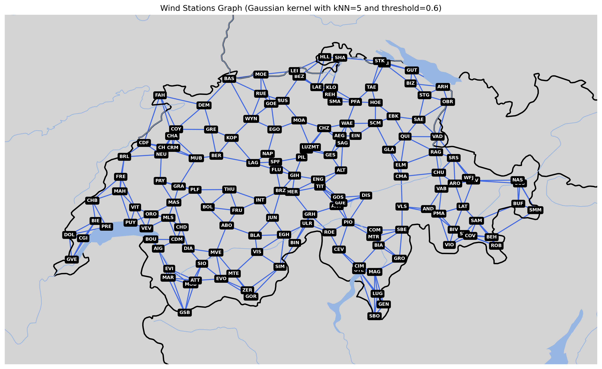

# Graph Deep Learning Postprocessing Project @USI

Project designed for the [Graph Deep Learning](https://search.usi.ch/en/courses/35270698/graph-deep-learning) course at Università della Svizzera italiana (USI), focusing on postprocessing wind NWP forecasts.



## Quickstart

0. **Install Poetry**

Use Python 3.11.0 or other compatible Version

```sh 
pip3 install poetry
poetry self add poetry-plugin-shell

```


1. **Install the dependencies:**
```sh 
poetry install
```

2. **Activate the environment:**
```sh
cd spatiotemporal_postprocessing
poetry shell
```

3. **Train**

Define the folder with the training data:

```sh
export DATA_BASE_FOLDER=<FOLDER>
```

Define the MLFlow tracking URI (defaults to a local folder called `mlruns`):

```sh
export MLFLOW_TRACKING_URI=<URI>
```

Train with default settings:
```sh
python train.py
```

Train with a different config:
```sh
python train.py --config-name <CFG>
```

Overwrite (if existing) or append (if not existing) a config value, such as the optimizer:

```sh
python train.py ++training.optim.algo=SDG
```

4. **Train Specific Model**

EnhancedGRUBaseline

EnhancedBiDirectionalSTGNN: (targets.nc and features.nc in folder GraphDL-Postprocess-USI-Project)

```sh
cd GraphDL-Postprocess-USI-Project/spatiotemporal_postprocessing
export DATA_BASE_FOLDER=../
export MLFLOW_TRACKING_URI=mlflow    
python train.py --config-name enhanced_bidirectional_rnn
```

EnhancedTCNGNN

MultiScaleGraphWaveNet

```sh
cd GraphDL-Postprocess-USI-Project/spatiotemporal_postprocessing
export DATA_BASE_FOLDER=../
export MLFLOW_TRACKING_URI=mlflow    
python train.py --config-name multiscalewave
```


5. **Check the logs on MLflow:**

```sh
cd GraphDL-Postprocess-USI-Project/spatiotemporal_postprocessing
export MLFLOW_TRACKING_URI=mlflow    
mlflow ui --backend-store-uri ./mlflow --port 5000
```


